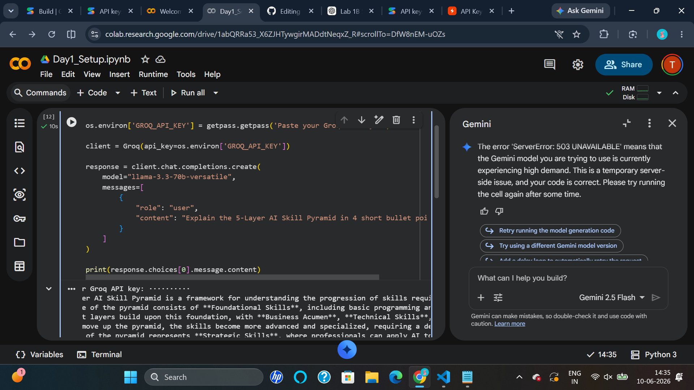

# ai-mentor-protifolio
# AI Mentor Bootcamp — Yandamuri Tejaswi

Public portfolio of 12-day AI Trainer Workshop. By Day 12: 6 daily notebooks + capstone Streamlit URL.

## Day 1 — Setup complete

-  Google AI Studio API key provisioned
-  Groq API key provisioned
-  Hello-Gemini call working — see [Day1_Setup.ipynb](Day1_Setup.ipynb)
- 4-tool comparison matrix from Lab 1A: see screenshot below

## Day 2 Lab 2B — Errors handled

1. Markdown fence wrapping
   Fixed using Pydantic validation.

2. Missing phone number
   phone is Optional[str] = None.

3. Empty input
   ValidationError raised and caught gracefully.

## Sample résumés processed: 3 / 3 successful
